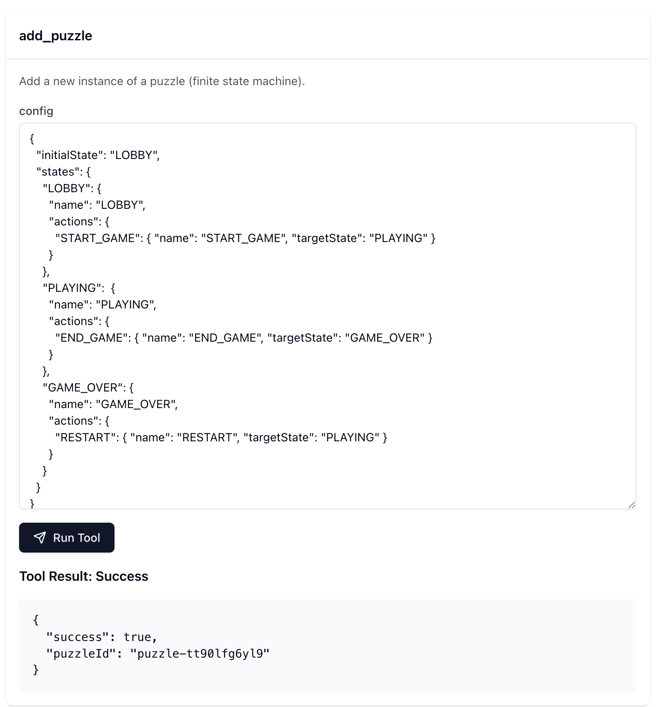
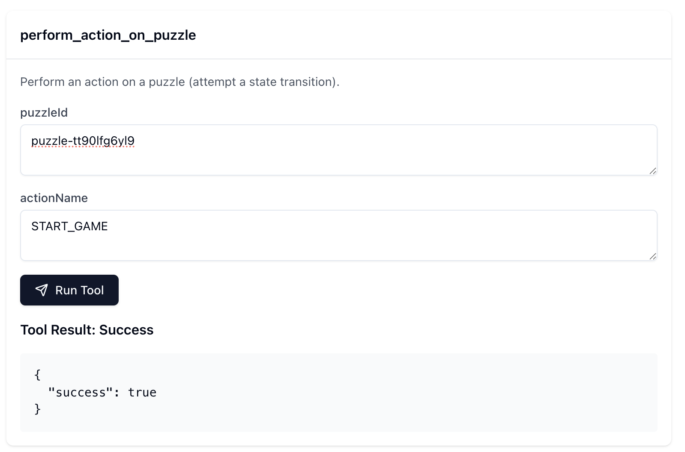
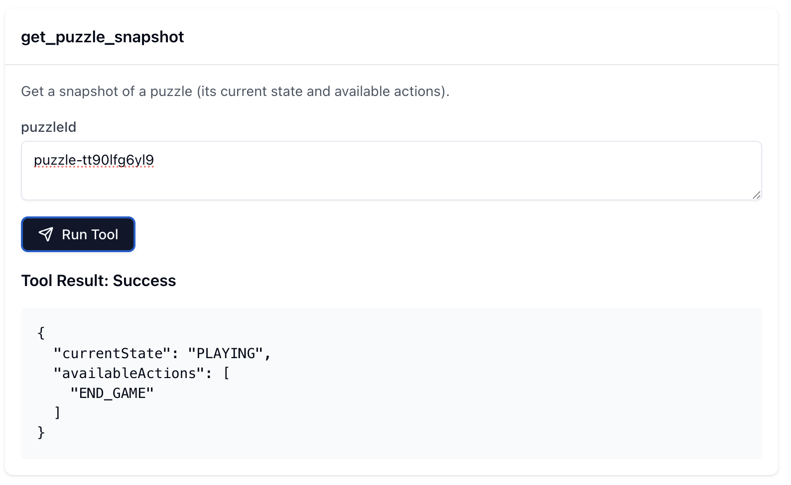
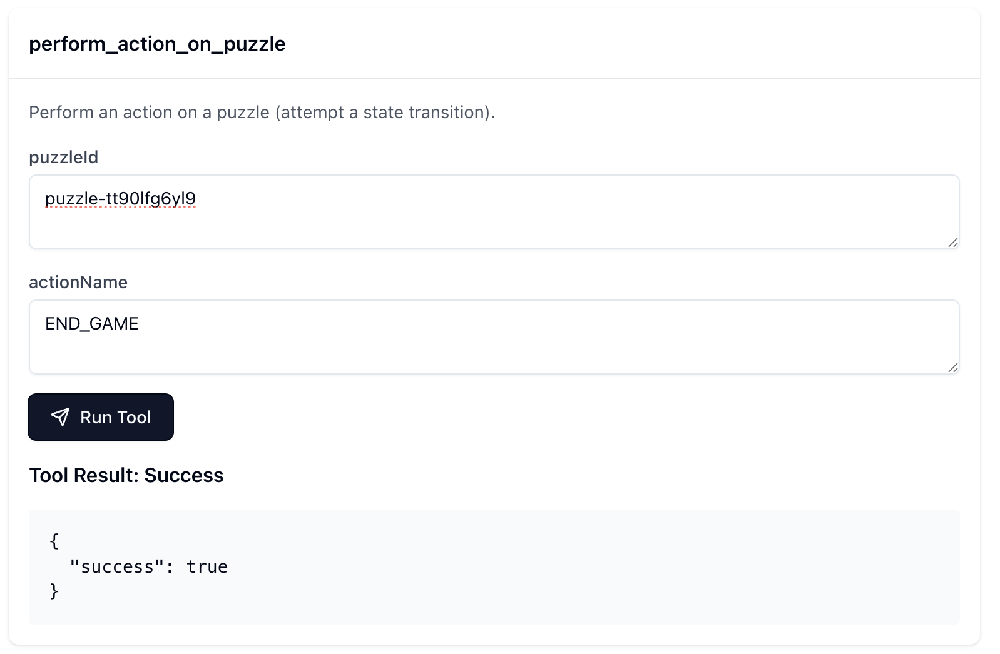

# puzzlebox
An [MCP server](https://github.com/modelcontextprotocol/specification/tree/main) that hosts dynamically configurable [finite state machines](https://en.wikipedia.org/wiki/Finite-state_machine) for managing agent and team process state.  

## What problem does puzzlebox address?
Marshalling multiple agents toward a big goal is about more than just breaking down a prompt into tasks and enabling collaboration.

A large software project typically moves through a non-linear and occasionally looping path from inception to design to building to testing to documentation to marketing to production. Different teams are focused on different aspects over time, informed by what's gone before and with an eye toward an ever-changing goal that is refined according to lessons learned. 

You can't control all that with just a prompt. 

## What is a Puzzle?
A Puzzle in puzzlebox is a finite state machine. It's just easier to say, write, and think about. 

Imagine the Rubik's Cube puzzle. It has 43 quintillion states, and to move between them, you make twists on the planes of the cube. 

An even more challenging puzzle is how create a non-trivial thing with AI agents, as that thing becomes more complex.

### Properties of a Puzzle
- A finite number of discrete states, e.g., "Inception", "Specification", "DomainModeling", "Design", "Build", etc.
- Each state may have any number of actions (including 0) that initiate transition to another state.
- There is an initial state.
- There is a current state that may differ after actions have been performed on the puzzle.
- Transitions can be canceled by state exit and enter guards, e.g., Consult LLM via client sampling request.

## What is Puzzlebox

An **MCP Server** implementation that:
  - Manages puzzle instances
  - Exposes tools for: 
    - Adding puzzles
    - Getting a snapshot of the state and available actions for a given puzzle in the box
    - Performing actions on a given puzzle in the box that trigger state transitions
  - Exposes registered puzzles as resources
    - Clients can use the `Puzzle Snapshot` resource template to fetch the resource by ID
    - Resource URI is `puzzlebox:/puzzle/{puzzleId}`
    - Clients can subscribe/unsubscribe to individual resource URIs
  
## Simple Example
```json
{
  "initialState": "LOBBY",
  "states": {
    "LOBBY": {
      "name": "LOBBY",
      "actions": {
        "START_GAME": { "name": "START_GAME", "targetState": "PLAYING" }
      }
    },
    "PLAYING":  {
      "name": "PLAYING",
      "actions": {
        "END_GAME": { "name": "END_GAME", "targetState": "GAME_OVER" }
      }
    },
    "GAME_OVER": {
      "name": "GAME_OVER",
      "actions": {
        "RESTART": { "name": "RESTART", "targetState": "PLAYING" }
      }
    }
  }
}
```

## Screenshots
Testing of the server was done with the official reference client - [the MCP Inspector](https://github.com/modelcontextprotocol/inspector). 
These screenshots show the various MCP tools and resources implemented by the sever..

### 0 - List Tools


### 1 - Add Puzzle


### 2 - Get Puzzle Snapshot (Initial State)


### 3 - Perform Action On Puzzle


### 4 - Get Puzzle Snapshot (New State)


### 5 - Perform Action On Puzzle


### 6 - Get Puzzle Snapshot (Another New State)


### 7 - List Resources


### 8 - Resource Template


### 9 - Unsubscribed Resource


### 10 - Subscribed Resource


### 11 - Subscribed Resource Updated Notification


## How It Works
1. Clients connect to a puzzlebox SSE server.
2. Clients register puzzles with the server.
3. Clients perform actions on puzzles.
4. The puzzlebox server ensures that any attempted action is valid for the current state of the given puzzle.
5. If an action is valid, a transition to the target state is initiated.
6. During transition, optional exit and enter guards may send sampling requests to the client, the results of which could lead to cancellation of the transition (think acceptance testing by stakeholders)
7. If guards pass, the state transition completes.
8. Clients update their UI based on the new state.
9. Clients can subscribe to a given puzzle to receive updates when its state changes.
10. If the client receives a resource updated notification, they can either read the resource or use the `get_puzzle_snapshot` tool to get the current state and avaialb actions

## MCP Tools

### ⚙️ **`add_puzzle`**
#### Add a new instance of a puzzle (finite state machine).
- **Inputs:** None
- **Returns:** JSON object with boolean `success` and `puzzleId`

### ⚙️ **`get_puzzle_snapshot`**
#### Get a snapshot of a puzzle (its current state and available actions).
- **Inputs:** `puzzleId`
- **Returns:** JSON object with `currentState` and `availableActions` array
- **Note:** MCP clients that don't support resource subscriptions can poll this tool to watch for state changes.

### ⚙️ **`perform_action_on_puzzle`**
#### Perform an action on a puzzle (attempt a state transition).
- **Inputs:** `puzzleId` and `actionName`
- **Returns:** JSON object with `currentState` and `availableActions` array

### ⚙️ **`count_puzzles`**
#### Get the count of registered puzzles
- **Inputs:** None
- **Returns:** JSON object with current `count` of registered puzzles

## Developer Setup

### Install Dependencies

- `cd /path/to/puzzlebox/`
- `npm install`

### Build

- `npm run build`
- Builds the stdio-based MCP server runtime at `/dist/index.js`

### Start

- `npm run start`
- Launches an SSE-based/MCP server on port `:3001` with endpoint `/sse`
- This has a single instance of the MCP server which multiple clients can connect to via SSE
- **MUST BE LAUNCHED BEFORE RUNNING INSPECTOR**

### Inspector

- `npm run inspector`
- Runs the [Model Context Protocol Inspector](https://modelcontextprotocol.io/docs/tools/inspector)
- The Inspector UI will be available at: http://localhost:5173
- In the Inspector UI:
  - Make sure `Transport Type` is set to `SSE`
  - Make sure `URL` is set to http://localhost:3001/sse
  - Click its **"Connect"** button to connect to the MCP Proxy
    - You should see Green light 🟢and **"Connected"** message.
  - Click its **List Tools** button

### Format

- `npm run format`
- Runs `prettier` on the code, adjusting formatting

### Typecheck

- `npm run typecheck`
- Runs `tsc` with args to check and report type issues

### Lint

- `npm run lint`
- Runs `eslint` to non-destructively check for and report syntax problems

### LintFix

- `npm run lint:fix`
- Runs `eslint` to check for and fix syntax problems

### Test

- `npm run test`
- Run the unit tests
